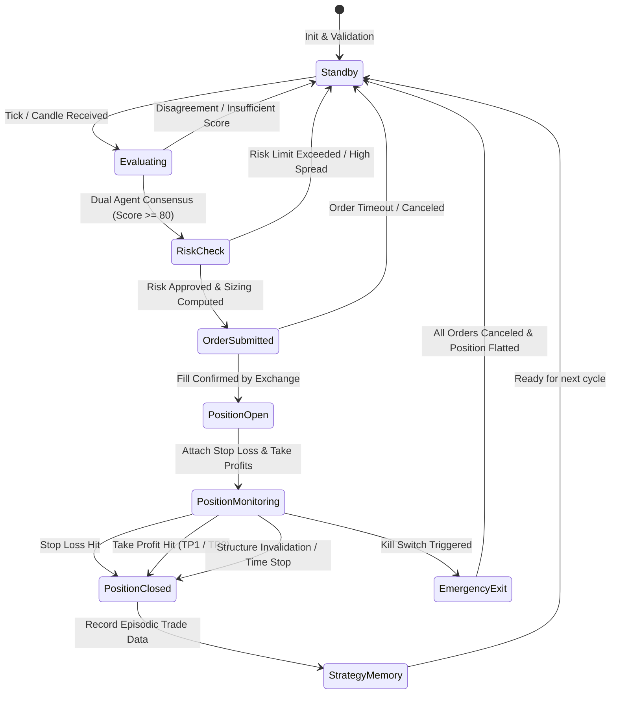

# System Design & Mathematical Formulations

## 1. Data Ingestion & Microstructure Math

### 1.1 Order Book Imbalance (OFI)
Order book imbalance measures the immediate resting supply/demand asymmetry across top $K$ price levels:
$$OFI = \frac{\sum_{i=1}^K V_{bid, i} - \sum_{i=1}^K V_{ask, i}}{\sum_{i=1}^K V_{bid, i} + \sum_{i=1}^K V_{ask, i}}$$
Where:
- $OFI \in [-1.0, 1.0]$
- $OFI > +0.30 \implies$ Strong Bid Pressure
- $OFI < -0.30 \implies$ Strong Ask Pressure

### 1.2 Time & Sales Aggressive Volume Flow
Aggressive buyer and seller volumes are segregated using trade execution flag (taker buy vs taker sell):
$$P_{buy} = \frac{V_{aggressive\_buy}}{V_{total}}, \quad P_{sell} = \frac{V_{aggressive\_sell}}{V_{total}}$$

### 1.3 Cumulative Volume Delta (CVD)
For each interval or tick $t$:
$$\Delta_t = V_{buy, t} - V_{sell, t}$$
$$CVD_t = CVD_{t-1} + \Delta_t$$

Divergence Detection Rules:
- **Bullish Divergence**: $P_t < P_{t-k}$ (Lower Low Price) AND $CVD_t > CVD_{t-k}$ (Higher Low CVD).
- **Bearish Divergence**: $P_t > P_{t-k}$ (Higher High Price) AND $CVD_t < CVD_{t-k}$ (Lower High CVD).

### 1.4 Gamma Exposure (GEX)
For strikes $K_j$ with open interest $OI_j$ and spot price $S$:
$$GEX = \sum_{j} \Gamma_j \cdot OI_{call, j} \cdot S^2 \cdot 0.01 - \sum_{j} \Gamma_j \cdot OI_{put, j} \cdot S^2 \cdot 0.01$$
- $\text{GEX} > 0 \implies$ Dealer long gamma $\implies$ Market mean-reversion dampener.
- $\text{GEX} < 0 \implies$ Dealer short gamma $\implies$ Volatility acceleration / trend expansion.

---

## 2. Technical & Smart Money Concepts (SMC) Engine

### 2.1 Volume-Weighted Average Price (VWAP)
$$\text{VWAP}_t = \frac{\sum_{i=1}^t P_{typical, i} \cdot V_i}{\sum_{i=1}^t V_i}, \quad P_{typical} = \frac{H + L + C}{3}$$
Standard Deviation Bands:
$$\sigma_t = \sqrt{\frac{\sum_{i=1}^t V_i \cdot (P_{typical, i} - \text{VWAP}_t)^2}{\sum_{i=1}^t V_i}}$$
$$\text{Upper Band}_k = \text{VWAP}_t + k \cdot \sigma_t, \quad \text{Lower Band}_k = \text{VWAP}_t - k \cdot \sigma_t \quad (k \in \{1, 2, 3\})$$

### 2.2 Smart Money Concepts (SMC) Formulations
- **Fair Value Gap (FVG)**:
  - Bullish FVG: $\text{Low}_{t} > \text{High}_{t-2}$ with strong displacement candle at $t-1$. Gap zone: $[\text{High}_{t-2}, \text{Low}_{t}]$.
  - Bearish FVG: $\text{High}_{t} < \text{Low}_{t-2}$ with strong displacement candle at $t-1$. Gap zone: $[\text{High}_{t}, \text{Low}_{t-2}]$.
- **Break of Structure (BOS)**: Candle body close beyond previous validated swing high/low in the direction of the dominant trend.
- **Change of Character (CHoCH)**: Candle body close beyond recent swing level opposing the prior trend direction, signaling market regime transition.
- **Order Block (OB)**: The last opposing candle prior to an impulsive displacement break of structure.

### 2.3 Volume Profile & Market Profile
- **Value Area Calculation**: 70% of total traded volume centered around the Point of Control (POC).
- **High Volume Nodes (HVN)**: Price levels with local volume maxima representing accepted fair value.
- **Low Volume Nodes (LVN)**: Price levels with volume vacuums representing rapid rejection zones.

### 2.4 Fractional Kelly Criterion
$$f^* = \frac{b \cdot p - q}{b}$$
Where:
- $p = \text{Empirical Win Probability}$
- $q = 1 - p$
- $b = \frac{\text{Average Win Amount}}{\text{Average Loss Amount}}$ (Payoff Ratio)
- Scaled Kelly Fraction:
$$f_{trade} = \min\left(\text{Kelly Multiplier} \times f^*, \text{MAX\_RISK\_PER\_TRADE}\right)$$
Default $\text{Kelly Multiplier} = 0.15$ (Quarter-Kelly safety cap).

---

## 3. Agent Scoring & Confidence Fusion

### 3.1 Agent 1 Scoring Breakdown (Max 100)
| Factor | Weight |
|---|---|
| Order Book Imbalance & Depth | 20 |
| Time & Sales Aggressive Velocity | 20 |
| CVD Trend & Divergence | 20 |
| Footprint Stacked Imbalances | 15 |
| Liquidity Map & Heatmap Bias | 15 |
| Market Regime Alignment | 10 |

### 3.2 Agent 2 Scoring Breakdown (Max 100)
| Factor | Weight |
|---|---|
| SMC Structure (BOS, CHoCH, OB, FVG) | 20 |
| Liquidity Sweeps & Target Pools | 15 |
| Multi-Timeframe Trend Agreement | 15 |
| Volume Profile (POC, VAH, VAL Rejection) | 10 |
| Market Profile TPO Balance | 10 |
| VWAP & Band Position | 10 |
| Momentum & Divergence (RSI/MACD) | 10 |
| Volatility Regime Compatibility | 10 |

### 3.3 Agent 3 Signal Fusion & Composite Confidence
$$\text{Confidence} = 0.35 \cdot S_1 + 0.35 \cdot S_2 + 0.10 \cdot R_{regime} + 0.10 \cdot R_{risk\_reward} + 0.10 \cdot Q_{execution}$$
Threshold for trade entry: $\text{Confidence} \ge 85.0$ and $S_1 \ge 80, S_2 \ge 80$ and $\text{Direction}_1 == \text{Direction}_2$.

---

## 4. Position & Risk Lifecycle State Machine

